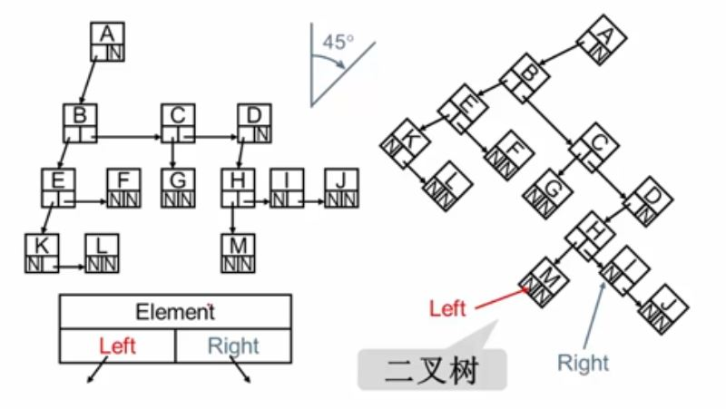

- [树](#树)
  - [树的术语](#树的术语)
  - [树的表示方法1：二叉树](#树的表示方法1二叉树)
    - [特殊的二叉树](#特殊的二叉树)
# 树
## 树的术语
* 根root ：节点 
* 子树subtree
* 节点的度(degree):每个节点子树的个数
* 树的度：节点最大的度
* 父节点(parent)
* 叶节点(leaf)
* 子节点(child)
* 兄弟节点(sibling)
* 节点的层次(level)
* 树的深度(Depth):最大层次

## 树的表示方法1：二叉树
<!--  -->

### 特殊的二叉树
* 斜二叉树
 > 
* 完美二叉树/满二叉树
 > 
* 完全二叉树
 >  
  

