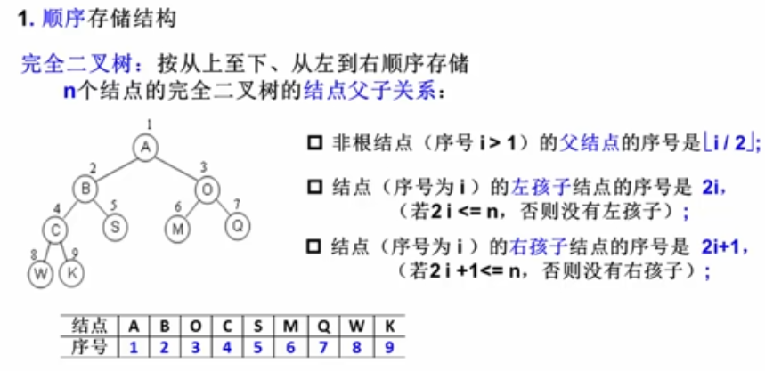

- [树](#树)
  - [树的术语](#树的术语)
  - [树的抽象数据类型](#树的抽象数据类型)
  - [树的表示方法1：二叉树](#树的表示方法1二叉树)
    - [特殊的二叉树](#特殊的二叉树)
    - [二叉树的性质](#二叉树的性质)
    - [二叉树的储存](#二叉树的储存)
      - [顺序储存](#顺序储存)
      - [链表储存](#链表储存)
    - [二叉树的遍历](#二叉树的遍历)
      - [前序后续中序递归](#前序后续中序递归)
      - [非递归中序遍历](#非递归中序遍历)
      - [队列层序遍历](#队列层序遍历)
    - [二叉树同构](#二叉树同构)
    - [二叉搜索树](#二叉搜索树)
      - [定义](#定义)
      - [查找算法](#查找算法)
      - [插入算法](#插入算法)
      - [删除算法](#删除算法)
    - [平衡树](#平衡树)
      - [概念](#概念)
      - [调整](#调整)
# 树
## 树的术语
* 根root ：节点 
* 子树subtree
* 节点的度(degree):每个节点子树的个数
* 树的度：节点最大的度
* 父节点(parent)
* 叶节点(leaf)
* 子节点(child)
* 兄弟节点(sibling)
* 节点的层次(level)
* 树的深度(Depth):最大层次
## 树的抽象数据类型
名称：树  
数据对象集：由节点和子树组成的集合  
操作集：
* 创建空树
* 取消树
* 遍历
* 判断是否为空

## 树的表示方法1：二叉树
<!--  -->


### 特殊的二叉树
* 斜二叉树
 > 
* 完美二叉树/满二叉树
 > 
* 完全二叉树
 >  
### 二叉树的性质
* 第i层的最大节点数为2$^{i-1}$；
* 深度为k的二叉树的最大节点数2$^k$-1
* 对于非空二叉树，叶节点的个数为n$_0$,度为2的节点个数为n$_2$，n$_0$=n$_2$+1  

### 二叉树的储存
#### 顺序储存
* 对于完全二叉树很完美
> 
* 对于一般二叉树会造成空间浪费
> 
#### 链表储存
```
typedef struct BintreeNode * BinTree;
struct BintreeNode
{
  ElemType Data;
  BinTree Right;
  BinTree Left;

}
```
### 二叉树的遍历
#### 前序后续中序递归
```
void traversal(BinTree BT)
{
  if(BT)
  {
    printf("%d",BT->Data);//现在是前序，放在第二位中序，放在第三位后序
    traversal(BT->Left);
    traversal(BT->Right);
  }
}
```
#### 非递归中序遍历
递归实质就是堆栈，所以直接用堆栈实现遍历
> 
#### 队列层序遍历
通过队列完成遍历
> 

### 二叉树同构
两个树相同则为同构。主要利用递归的思想完成。

### 二叉搜索树
#### 定义
树的左边比中间小，树的右边比中间大的数。
#### 查找算法
* 递归
> 
* 循环
> 
#### 插入算法
* 递归
> 
#### 删除算法
* 如果是叶节点，直接删除，并置为null
* 如果只有一个儿子（左或者右），那么删除节点，返回儿子就可以
* 如果删除的有左右两个儿子：
> * 用左儿子里的最大值代替节点，删除左儿子的最大值
> * 用右儿子里的最小值代替节点，删除右儿子的最小值
> 
### 平衡树
#### 概念
左子树与右子树的深度相差不大于1  
左子树与右子树的深度差又称为平衡因子  
平衡树可以让搜索的效率提高，通俗的讲就是树越平衡越矮，越方便搜索。
#### 调整
但是平衡树插入新的值时会破坏结构，导致不再是平衡树，所以需要相应的调整，调整的测率又LL，LR，RR，RL  
举例： 
> 
